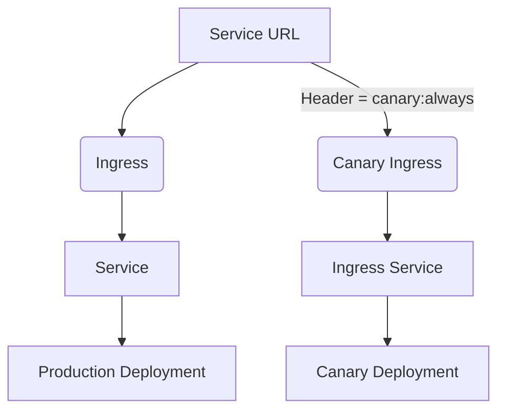

# AutoDeploy Canary deployment chart  

This chart is the modified form of official [auto-deploy-app](https://gitlab.com/gitlab-org/charts/auto-deploy-app) that is intended to achieve traffic routing in `canary deployment` using `nginx-ingress`.  

## Traffic Routing in Auto Deploy canary deployments using Nginx-ingress
The traffic routing in canary deployment is done based on header value while using `nginx-ingress` and AutoDevOps.  
## How it works
We used `canary by header value` feature of `nginx-ingress` annotations https://kubernetes.github.io/ingress-nginx/user-guide/nginx-configuration/annotations/#canary.  
For that we had to modify official chart https://gitlab.com/gitlab-org/charts/auto-deploy-app to add two additional resources that are created during `canary` stage:
* `canary-ingress` : [ingress-canary.yaml](templates/ingress-canary.yaml)
* `canary-service` : [service-canary.yaml](templates/service-canary.yaml)




The `canary-ingress` checks for header `canary`, if set, routes to `canary` service backend that then forwards  to `canary-deployment`.  

**NOTE** : There was a bug in [auto-deploy-app](https://gitlab.com/gitlab-org/charts/auto-deploy-app/-/issues/51) where the `production` service was pointing to both `production` deployment and `production-canary` deployment based on its selectors. This chart also takes care of it [here](https://gitlab.com/hayderimran7/auto-deploy-canary-chart/-/blob/master/templates/service.yaml#L29)

## Testing in AutoDevops 

Simply set `CANARY_ENABLED` in your `.gitlab-ci.yml` when using AutoDevops.  
Deploy the app using this chart in `production` and then to `canary`. (this order is important because autodevops does not create any service/ingress in canary stage)

Now make a request to service URL as:
```
curl -H "canary: always" http://<service-url> 
```
 This will hit the `canary-ingress` that will route to `canary-deployment` that you can verfiy in pod logs. 

